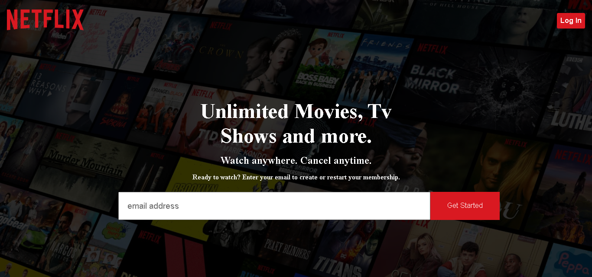
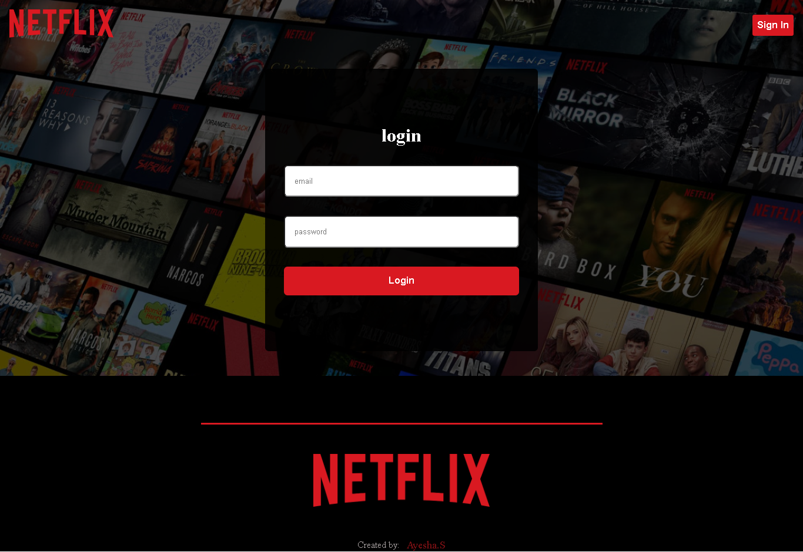
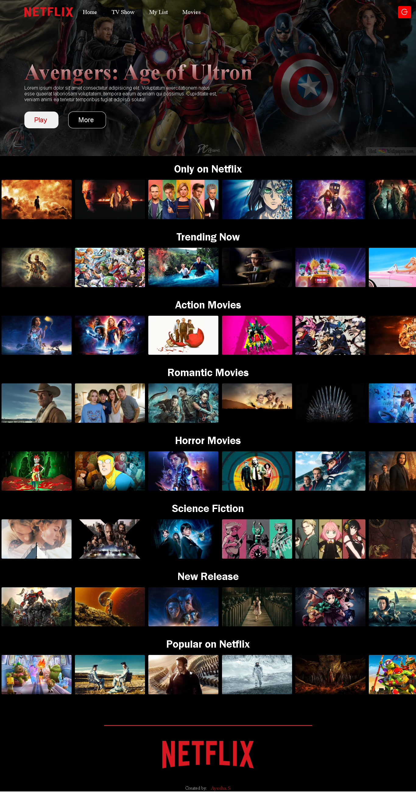

# Netflix Clone with React JS

This project is a Netflix clone built with React JS, styled components, `useNavigate`, `useEffect`, `useRef`, `useState`, Axios, Redux Toolkit, Firebase Authentication, and an external movie database API.

## Features

- **React JS**: A powerful JavaScript library for building user interfaces.
- **Styled Components**: Used for styling React components.
- **React Hooks**: Utilized `useNavigate`, `useEffect`, `useRef`, `useState` for navigation, side effects, references, and state management.
- **Axios**: A promise-based HTTP client for making requests to external APIs.
- **Redux Toolkit**: A state management library for handling application state.
- **Firebase Authentication**: Integrated for user authentication and authorization.
- **Movie Database API**: External API used for fetching movie data.

## Installation

1. **Clone the repository:**

   ```bash
   git clone https://github.com/ayeshasikander/Netflix-Clone.git
   cd netflix-clone
   ```

2. **Install dependencies:**

   ```bash
   npm install
   ```

3. **Configure Firebase:**

   - Create a Firebase project on the [Firebase Console](https://console.firebase.google.com/).
   - Obtain the Firebase configuration and update it in the project where needed.

4. **Configure Movie Database API:**

   - Obtain an API key from [The Movie Database (TMDb)](https://www.themoviedb.org/documentation/api).
   - Update the API key in the project where Axios makes requests to the movie database API.

## Usage

1. **Run the application:**

   ```bash
   npm start
   ```

2. **Open your browser and navigate to [http://localhost:3000](http://localhost:3000) to view the Netflix clone.**

## Contributing

If you'd like to contribute to this project, please follow the standard GitHub flow:

1. Fork the project.
2. Create a new branch for your feature or bug fix.
3. Make your changes.
4. Submit a pull request.


## images:




## License

This project is licensed under the [MIT License](LICENSE).